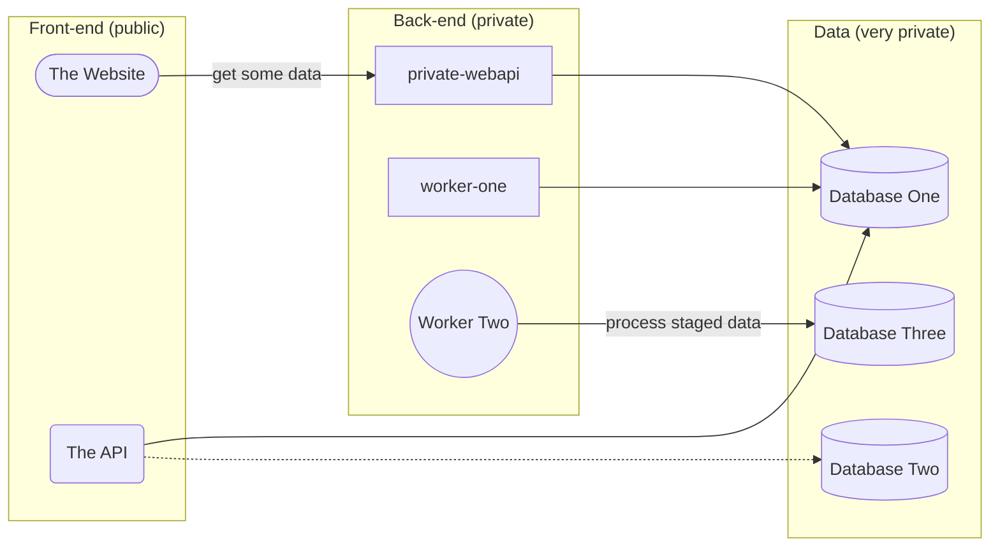

# adventure-playground

Just a sandpit repository for playing around with github features and actions!

## Mermaid Diagramming

Flowcharts can be:

- TB - Top to bottom
- TD - Top-down/ same as top to bottom
- BT - Bottom to top
- RL - Right to left
- LR - Left to right

