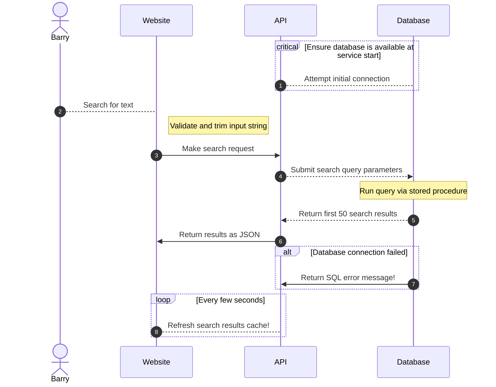
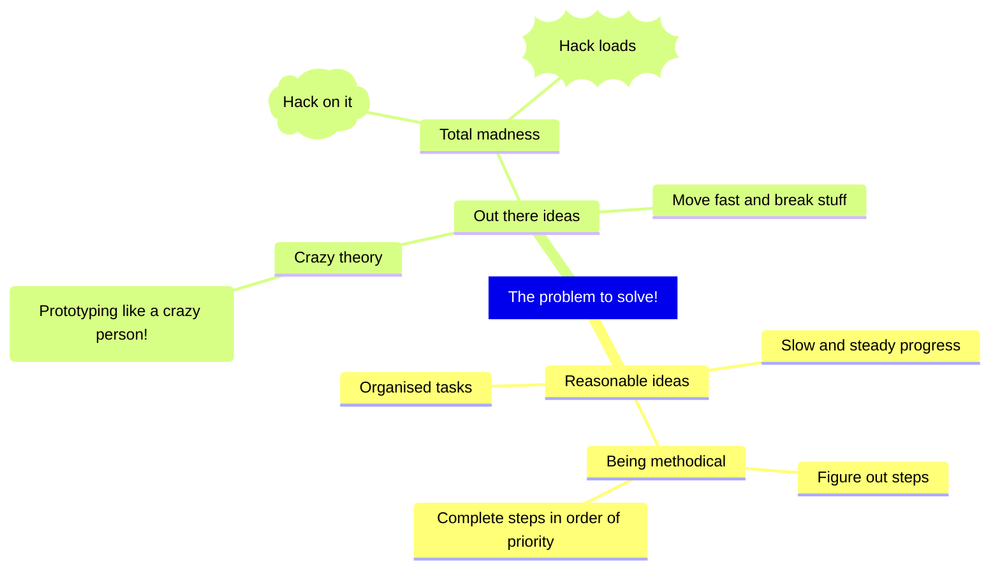

# adventure-playground

Just a sandpit repository for playing around with github and docker!

## TODO: Figure out how to do the following!

1. Build SimpleWebApi using a multistage docker build as a devcontainer. https://docs.github.com/en/codespaces/setting-up-your-project-for-codespaces/adding-a-dev-container-configuration/introduction-to-dev-containers and https://code.visualstudio.com/docs/devcontainers/containers
2. Run SQL Server as a container. See https://learn.microsoft.com/en-us/sql/linux/quickstart-install-connect-docker?view=sql-server-ver16&tabs=cli&pivots=cs1-bash
3. Run both SimpleWebApi and SQL Server containers in a dev-network using docker compose.
4. Attempt to call SQL Server from SimpleWebApi to prove database connectivity. Just use https://github.com/DapperLib/Dapper for simplicity! No EF!
5. Figure out how best to seed a database? Bootstrap a populated database and bake into an image _(fast and ephemeral)_ or persist a database or databases by attaching as/swapping between volumes?

## Docker Notes

If you generate a multistage Dockerfile automatically with Visual Studio the paths will be set up to expect the docker build to be run from the same path as the solution file. If you run the docker build yourself, you'll need to point it to the Dockerfile in the project folder as below:

```
docker build -f SimpleWebApi/Dockerfile -t simplewebapi .
```

It looks like this in a docker compose YML file:

```yml
services:
  simplewebapi:
    build:
      context: "../src/SimpleWebApi"
      dockerfile: "SimpleWebApi/Dockerfile"
    ports:
      - "8080:8080"
```

Exposing the ports or an ASP.NET web application for any IP instead of just localhost seems to be done automatically now. But if you have problems see: https://andrewlock.net/why-isnt-my-aspnetcore-app-in-docker-working/

By default, the Swagger UI will not be active in an ASP.NET Core application unless the `ASPNETCORE_ENVIRONMENT=Development` environment variable is set.

Executing a command inside a SQL Server container:

```
cd /opt/mssql-tools/bin

./sqlcmd -U sa -P [REDACTED!] -q "select name from sys.databases"
```

## Mermaid Diagramming

Flowcharts can be:

- TB - Top to bottom
- TD - Top-down/ same as top to bottom
- BT - Bottom to top
- RL - Right to left
- LR - Left to right


Sequence diagram:



Mindmap:


